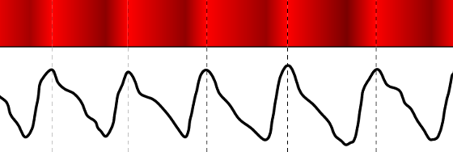

# Monitoramento sono
Este projeto tem por objetivo o desenvolvimento de um sistema de monitoramento do sono, desenvolvido na disciplina de Projeto Integrador 3 (PIN22107) do curso de graduação em Engenharia Eletrônica do Instituto Federal de Educação, Ciência e Tecnologia de Santa Catarina (IFSC). Este projeto foi dividido em dois subsistemas básicos, uma luva de monitoramento e acompanhamento de atividades noturna e uma estação base para monitoramento do ambiente. 

## Especificações do projeto
* Monitoramento dos principais sinais necessarios para a análise do sono.
* Desenvolvimento de um circuito de baixo consumo energético alimentado por batería.
* Entrega dos dados ao usuário via rede wireless. 

## Etapas de desenvolvimento do projeto
Neste projeto, com a finalidade de se obter um melhor fluxo de desenvolvimento, dividiu-se em 7 etapas, sendo elas: 
1. Análise bibliográfica referente ao desenvolvimento de sistemas de monitoramento de sono, buscando obter informações sobre os principais sinais vitais que devem ser analisados para a avaliação do sono do usuário. 
1. Seleção dos sensores e atuadores a serem utilizados no desenvolvimento do projeto. 
1. Planejamento da rede de comunicação entre luva, base e computador do usuário. 
1. Desenvolvimento de uma luva contendo os principais sensores necessários para a leitura dos sinais provenientes do corpo do usuário. 
1. Desenvolvimento da estação base de monitoramento do ambiente, contendo, por exemplo, sensores de luminosidade e temperatura. 
1. Integração dos subsistemas (luva e estação base) com o computador do usuário. 
1. Finalização, testes e validação do projeto. 

## Polissonografia
A polissonografia é o padrão-ouro para diagnóstico de distúrbios do sono em adultos, adolescentes e crianças. Também conhecida como exame do sono, a polissonografia é um exame não invasivo e indolor. Para realização desse exame o paciente dorme com eletrodos fixados no corpo de modo a registrar simultaneamente diferentes sinais biofisiológicos. Os principais parâmetros analisados são:

* **Eletroencefalograma (EEG):** atividade cerebral;
* **Eletro-oculograma (EOG):** identificação das fases do sono e quando começam;
* **Eletro-miograma (EMG):** atividade dos músculos;
* **Fluxo aéreo da boca e nariz:** respiração;
* **Esforço respiratório:** tórax e abdômen;
* **Eletrocardiograma (ECG):** ritmo de operação do coração;
* **Oximetria:** taxa de oxigênio no sangue;
* **Sensor de ronco:** intensidade do ronco;

É importante que o paciente não esteja apresentando gripe, tosse, resfriado, febre ou outros problemas que possam interferir no sono e no resultado do exame. Dentre os distúrbios de saúde conhecidos, os principais que podem diminuir a qualidade do sono são:

* Apnéia obstrutiva do sono;
* Roncos excessivos;
* Insônia;
* Sonolência excessiva;
* Sonambulismo;
* Narcolepsia;
* Síndrome das pernas inquietas;
* Arritmias que ocorrem durante o sono;
* Terror noturno;
* Bruxismo.

De forma geral, a polissonografia é realizada em uma clínica especializada em sono ou de neurologia e o paciente precisa permanecer sob observação durante uma noite de sono no hospital para aquisição dos sinais vitais mencionados, conforme exibe a Figura 1. O preço desse exame pode variar de R$800,00 a R$1.200,00, dependendo do local e parâmetros avaliados durante o exame. Existem casos de monitoramento domiciliar, com aparelhos portáteis como o ilustrado na Figura 2, sendo mais simples que os realizados nos hospitais, todavia úteis em casos específicos.

Figura 1. Exame de polissonografia em clínica especializada.

Figura 2. Exame de polissonografia com aparelho portátil.

Com base nos sinais vitais mencionados no exame de polissonografia, foi projetado um sistema que possibilitasse o monitoramento de alguns desses sinais, além do monitoramento do ambiente em que a pessoa dorme, para posterior análise por um profissional da área do sono. 
Dentre os parâmetros biofisiológicos destacados, esse projeto visa utilizar os seguintes sensores:

* Oxímetro de pulso: monitorar a taxa de oxigênio no sangue e frequência cardíaca;
* Acelerômetro: monitorar o movimento do paciente;
* Sensor de temperatura corporal: monitorar a temperatura do paciente durante o sono.

Como o ambiente em que o paciente está dormindo também influencia na qualidade do sono, optou-se por monitorar quatro parâmetros do ambiente conforme os sensores listados abaixo:

* Sensor de temperatura e umidade do ambiente;
* Sensor de luminosidade;
* Sensor de detecção de ruído;

O projeto foi dividido então em duas partes, sendo a luva de monitoramento de sinais vitais e a estação base. Ambos serão detalhados em sequência, desde os sensores utilizados até o funcionamento do sistema projetado.

## Luva de monitoramento de sinais vitais: 
Definido os principais sinais vitais a serem obtidos, foi realizada uma análise nos diferentes tipos de sensores disponíveis, para assim, dar início ao planejamento da estrutura do software da luva de aquisição dos sinais do usuário. Neste projeto, optou-se pelo desenvolvimento do oxímetro de pulso, responsável pela obtenção da taxa de oxigenação sanguínea e dos batimentos cardíacos. 

### Oximetro de pulso:
Dentre os sinais vitais utilizados para o monitoramento da saúde do sono de um indivíduo, encontra-se o monitoramento da oxigenação sanguínea. Segundo Lima (2009), por muito tempo a medição deste sinal era realizado de forma invasiva, mas atualmente, o método mais adequado empregado nessa medição é através de um oxímetro de pulso, que utiliza a fotopletismografia.
A fotopletismografia, de acordo com Oshiro (2011), é uma técnica que utiliza uma fonte de luz monocromática aplicada sobre um tecido, medindo, assim, a quantidade de luz que é transmitida ou refletida por ele. Essa luz muda de acordo com a variação do volume sanguíneo, venoso e arterial, possibilitando o monitoramento da saturação de oxigênio, juntamente com o monitoramento dos batimentos cardíacos. Este efeito pode ser observado na Figura 3.

Figura 2. Sinal gerado por um oxímetro de pulso.

Segundo Lima (2006 apud ELSHARYDAH, 2009), cada substância possui diferentes capacidades de absorção de luz, que é em função do comprimento de onda da luz que incide sobre ela. Para o caso das hemoglobinas, oxigenada (HbO2) e não oxigenada (Hb), temos como os principais comprimento de onda absorvidos a luz infravermelho (940 nm) e vermelha (660 nm), como pode ser observado na Figura 4.

Figura 2. Espectro de absorção de luz das hemoglobinas HbO2 e Hb.

Para este projeto, foi utilizado o oxímetro de pulso transmissivo, ainda havendo o oxímetro de pulso reflexivo, que não foi utilizado devido a sua complexidade de projeto. O circuito básico de um oxímetro de pulso consiste na utilização de dois LEDs (um vermelho e outro infravermelho) para a emissão da luz e um fotodetector para a leitura da luz transmitida, estando o fotodetector posicionado de maneira oposta aos LEDs, como pode ser observado na Figura X. Para este projeto, foi utilizado o fototransistor TIL78 como fotodetector e o LED infravermelho TIL32 e um LED vermelho de alto brilho como fototransmissores.

VAI UMA FIGURA DA POSICAO DOS LEDS AKI

## Autores
* Diesson Stefano Allebrandt
* Marcos Vinícius Leal da Silva

## Bibliografia
