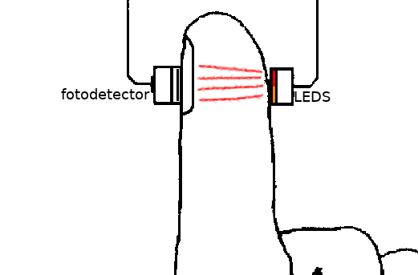
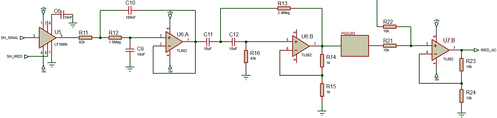
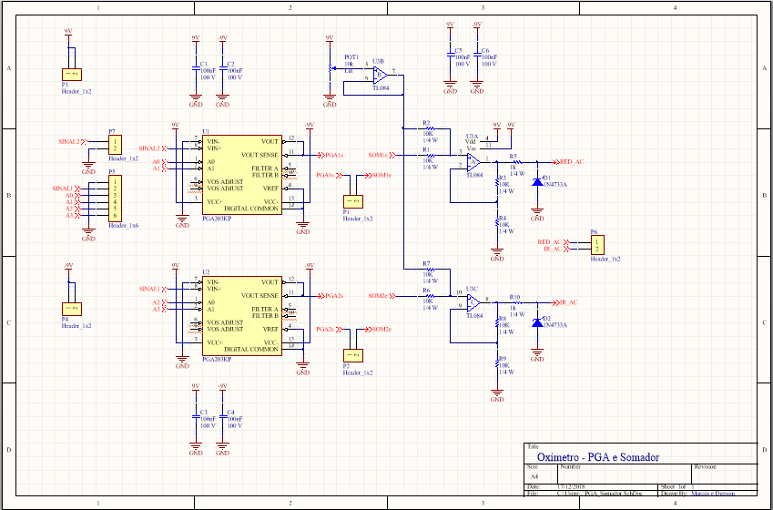
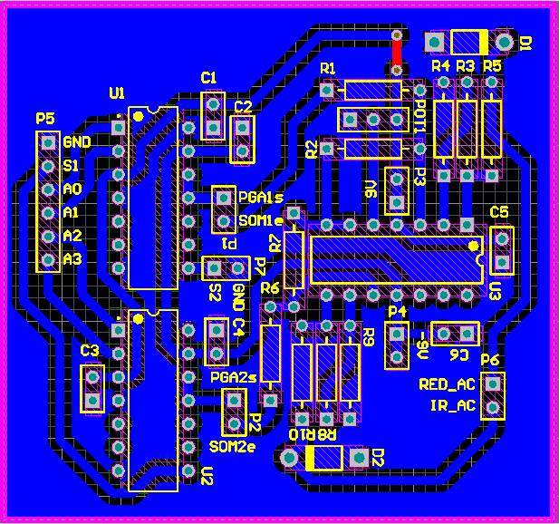
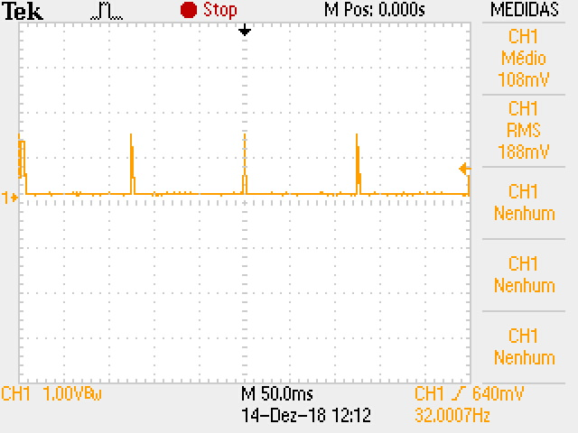

# Monitoramento sono
Este projeto tem por objetivo o desenvolvimento de um sistema de monitoramento do sono, desenvolvido na disciplina de Projeto Integrador 3 (PIN22107) do curso de graduação em Engenharia Eletrônica do Instituto Federal de Educação, Ciência e Tecnologia de Santa Catarina (IFSC). Este projeto foi dividido em dois subsistemas básicos, uma luva de monitoramento e acompanhamento de atividades noturna e uma estação base para monitoramento do ambiente. 

## Especificações do projeto
* Monitoramento dos principais sinais necessarios para a análise do sono.
* Desenvolvimento de um circuito de baixo consumo energético alimentado por bateria.
* Entrega dos dados ao usuário via rede wireless. 

## Etapas de desenvolvimento do projeto
Neste projeto, com a finalidade de se obter um melhor fluxo de desenvolvimento, dividiu-se em 7 etapas, sendo elas: 
1. Análise bibliográfica referente ao desenvolvimento de sistemas de monitoramento de sono, buscando obter informações sobre os principais sinais vitais que devem ser analisados para a avaliação do sono do usuário. 
1. Seleção dos sensores e atuadores a serem utilizados no desenvolvimento do projeto. 
1. Planejamento da rede de comunicação entre luva, base e computador do usuário. 
1. Desenvolvimento de uma luva contendo os principais sensores necessários para a leitura dos sinais provenientes do corpo do usuário. 
1. Desenvolvimento da estação base de monitoramento do ambiente, contendo, por exemplo, sensores de luminosidade e temperatura. 
1. Integração dos subsistemas (luva e estação base) com o computador do usuário. 
1. Finalização, testes e validação do projeto. 

## Polissonografia
A polissonografia é o padrão-ouro para diagnóstico de distúrbios do sono em adultos, adolescentes e crianças. Também conhecida como exame do sono, a polissonografia é um exame não invasivo e indolor. Para realização desse exame o paciente dorme com eletrodos fixados no corpo de modo a registrar simultaneamente diferentes sinais biofisiológicos. Os principais parâmetros analisados são:

* **Eletroencefalograma (EEG):** atividade cerebral;
* **Eletro-oculograma (EOG):** identificação das fases do sono e quando começam;
* **Eletro-miograma (EMG):** atividade dos músculos;
* **Fluxo aéreo da boca e nariz:** respiração;
* **Esforço respiratório:** tórax e abdômen;
* **Eletrocardiograma (ECG):** ritmo de operação do coração;
* **Oximetria:** taxa de oxigênio no sangue;
* **Sensor de ronco:** intensidade do ronco;

É importante que o paciente não esteja apresentando gripe, tosse, resfriado, febre ou outros problemas que possam interferir no sono e no resultado do exame. Dentre os distúrbios de saúde conhecidos, os principais que podem diminuir a qualidade do sono são:

* Apnéia obstrutiva do sono;
* Roncos excessivos;
* Insônia;
* Sonolência excessiva;
* Sonambulismo;
* Narcolepsia;
* Síndrome das pernas inquietas;
* Arritmias que ocorrem durante o sono;
* Terror noturno;
* Bruxismo.

De forma geral, a polissonografia é realizada em uma clínica especializada em sono ou de neurologia e o paciente precisa permanecer sob observação durante uma noite de sono no hospital para aquisição dos sinais vitais mencionados, conforme exibe a Figura 1. O preço desse exame pode variar de R$800,00 a R$1.200,00, dependendo do local e parâmetros avaliados durante o exame. Existem casos de monitoramento domiciliar, com aparelhos portáteis como o ilustrado na Figura 2, sendo mais simples que os realizados nos hospitais, todavia úteis em casos específicos.

Figura 1. Exame de polissonografia em clínica especializada.

Figura 2. Exame de polissonografia com aparelho portátil.

Com base nos sinais vitais mencionados no exame de polissonografia, foi projetado um sistema que possibilitasse o monitoramento de alguns desses sinais, além do monitoramento do ambiente em que a pessoa dorme, para posterior análise por um profissional da área do sono. 

Dentre os parâmetros biofisiológicos destacados, esse projeto visa utilizar os seguintes sensores:

* Oxímetro de pulso: monitorar a taxa de oxigênio no sangue e frequência cardíaca;
* Acelerômetro: monitorar o movimento do paciente;
* Sensor de temperatura corporal: monitorar a temperatura do paciente durante o sono.

Como o ambiente em que o paciente está dormindo também influencia na qualidade do sono, optou-se por monitorar quatro parâmetros do ambiente conforme os sensores listados abaixo:

* Sensor de temperatura e umidade do ambiente;
* Sensor de luminosidade;
* Sensor de detecção de ruído;

O projeto foi dividido então em duas partes, sendo a luva de monitoramento de sinais vitais e a estação base. Ambos serão detalhados em sequência, desde os sensores utilizados até o funcionamento do sistema projetado.

## Luva de monitoramento de sinais vitais: 
Definido os principais sinais vitais a serem obtidos, foi realizada uma análise nos diferentes tipos de sensores disponíveis, para assim, dar início ao planejamento da estrutura do *software* da luva de aquisição dos sinais do usuário. Neste projeto, optou-se pelo desenvolvimento do oxímetro de pulso, responsável pela obtenção da taxa de oxigenação sanguínea e dos batimentos cardíacos. Além disso foi decidido também fazer a leitura de um acelerômetro, com o intuito de obter a quantidade de movimentação do usuário, e de um sensor de temperatura bem próximo a pele do usuário, tendo assim uma estimativa da temperatura corporal do mesmo.

### Oximetro de pulso:
Dentre os sinais vitais utilizados para o monitoramento da saúde do sono de um indivíduo, encontra-se o monitoramento da oxigenação sanguínea. Segundo Lima (2009), por muito tempo a medição deste sinal era realizado de forma invasiva, mas atualmente, o método mais adequado empregado nessa medição é através de um oxímetro de pulso, que utiliza a fotopletismografia.

A fotopletismografia, de acordo com Oshiro (2011), é uma técnica que utiliza uma fonte de luz monocromática aplicada sobre um tecido, medindo, assim, a quantidade de luz que é transmitida ou refletida por ele. Essa luz muda de acordo com a variação do volume sanguíneo, venoso e arterial, possibilitando o monitoramento da saturação de oxigênio, juntamente com o monitoramento dos batimentos cardíacos. Este efeito pode ser observado na Figura 3.

Figura 3. Sinal gerado por um oxímetro de pulso.

Segundo Lima (2006 apud ELSHARYDAH, 2009), cada substância possui diferentes capacidades de absorção de luz, que é em função do comprimento de onda da luz que incide sobre ela. Para o caso das hemoglobinas, oxigenada (HbO2) e não oxigenada (Hb), temos como os principais comprimento de onda absorvidos a luz infravermelho (940 nm) e vermelha (660 nm), como pode ser observado na Figura 4.

Figura 4. Espectro de absorção de luz das hemoglobinas HbO2 e Hb.

Para este projeto, foi utilizado o oxímetro de pulso transmissivo, ainda havendo o oxímetro de pulso reflexivo, que não foi utilizado devido a sua complexidade de projeto. O circuito básico de um oxímetro de pulso consiste na utilização de dois LEDs (um vermelho e outro infravermelho) para a emissão da luz e um fotodetector para a leitura da luz transmitida, estando o fotodetector posicionado de maneira oposta aos LEDs, como pode ser observado na Figura 5. Para este projeto, foi utilizado o fototransistor TIL78 como fotodetector e o LED infravermelho TIL32 e um LED vermelho de alto brilho como fototransmissores.

Figura 5. Posicionamento dos LEDs e fotodetector.

O diagrama de blocos do circuito do oxímetro pode ser observado na Figura 6.

Figura 6. Estrutura de blocos do oxímetro.

Após obtido o sinal, o mesmo é enviado para um microcontrolador, onde é feito o cálculo da oxigenação sanguínea e dos batimentos cardíacos. Assim, para a sua amostragem, o circuito proposto consiste no acionamento do LED vermelho e do infravermelho de forma alternada utilizando um mesmo fotodetector, e em seguida, com dois circuitos integrados de amostragem (*sample and hold*) estes sinais seriam separados. Com ambos os sinais já separados, os mesmo passariam por um circuito de filtro chebyshev passa-baixa com frequência de 15 Hz, para que os sinais pudessem ser reconstruídos da melhor forma possível, eliminando possíveis discretizações geradas pelo amostrador. Neste ponto, a tensão média do sinal vermelho e infravermelho podem ser obtidos para o cálculo da oxigenação sanguínea. 

Em seguida, utilizando um filtro chebyshev passa-alta com frequência de 50 mHz, é eliminado toda a parte CC do sinal, permitindo, assim, que seja aplicado um ganho controlável utilizando um PGA (*programmable-gain amplifier*) apenas no sinal alternado. Ao final tem-se um circuito somador, para que o sinal fique inteiramente positivo (entre 0 e 5 V), possibilitando, assim, a amostragem do sinal pelo ADC do microcontrolador. Na figura 7 é apresentando o circuito utilizado, com os valores de componentes calculados. 

Figura 7. Circuito do oximetro com valores calculados.

Com a amostragem pelo microcontrolador, pode-se realizar os cálculos da oxigenação sanguínea e, utilizando um algoritmo de detecção de pico, realizar a contagem dos batimentos cardíacos, com base no período do sinal amostrado.

### Acelerometro:

Um bom descanso está atrelado a baixa movimentação do paciente, haja visto que o movimento indica que o paciente acordou totalmente ou parcialmente por algum desconforto. É necessário então um sensor que auxilie a identificar se o paciente está se movimentando.

O acelerômetro é um sensor que serve para medir a aceleração própria de um sistema. A aceleração própria é uma medida relacionada a outro sistema em queda livre, ou seja, um acelerômetro em repouso sobre a superfície da Terra indicará uma aceleração de 1 g (9,81 m/s²) para cima pois em relação a um objeto em queda livre o mesmo está acelerado a 9,81 m/s² para cima. No setor de saúde os acelerômetros são amplamente utilizados para medir a inclinação de membros. Eles podem funcionar a partir de diversos efeitos físicos, como piezoeletricidade, piezoresistividade e capacitância.

Existem acelerômetros de um eixo e de multiplos eixos para detectar magnitude e direção da aceleraçao própria do objeto, além disso os acelerômetros são também utilizados como sensores de orientação, pois é possível inferir a posição do objeto ao qual o mesmo está acoplado com base na mudança da aceleração própria.

Nesse projeto foi utilizado o sensor GY-80, exibido na Figura 8, sendo uma unidade de medida inercial (do inglês *IMU - Inertial Measurement Unit*), que contém o acelerômetro digital de 3 eixos ADXL345. 

Figura 8. Unidade de medida inercial GY-80.

A comunicação do GY-80 é feita pela interface I2C disponível no mesmo e os sensores são endereçados individualmente, logo é possível acessar os dados dos 3 eixos do acelerômetro facilmente. 

### Sensor de temperatura corporal:

Um indicativo que há algo errado no corpo humano é a temperatura do mesmo. O corpo humano possui uma estreita faixa térmica de trabalho que fica entre 36 ºC e 37,5 ºC. Portanto um aumento ou diminuição de temperatura fora da faixa indicada, conforme exibido na Figura 9, influenciará na qualidade de sono de uma pessoa.

Figura 9. Faixas de temperatura corporal.

Nesse projeto foi utilizado o sensor de temperatura e pressão BMP085, presente na *IMU* GY-80 (Figura 9). É importante ressaltar que foi feita somente a leitura da temperatura do mesmo, descartando então a pressão. De forma similar ao discutido no tópico de acelerômetro, fez-se a leitura da temperatura pela interface I2C disponível no sensor GY-80.

### Microcontrolador e sistema:

Para este projeto, optou-se pela utilização do microcontrolador ATmega328p programado em linguagem C, devido a familiaridade e o fácil uso do microcontrolador. O ATmega328p, segundo Lima e Villaça (2012), é um microcontrolador de 8 bits de baixa potência, com arquitetura RISC avançada. 

Para o programa do microcontrolador, optou-se pela elaboração de uma máquina de estados, como apresentado na Figura 10, utilizando um ponteiro de função. Esta máquina de estados permite que o microcontrolador faças as aquisições necessárias, e, logo em seguida, entre em um estado de baixo consumo (*sleep*).

Figura 10. Máquina de estados da luva de monitoramento corporal.

Após a inicialização do microcontrolador, o mesmo entra na função de inicialização da máquina de estados, responsável pela inicialização das variáveis, dos temporizadores (*timers*) e do ADC (*analog to digital converter*). Em seguida os estados começam a operar tendo início pelo estado “vermelho”, seguido pelos estados “infravermelho” e “processamento”. Esses estados são responsáveis pela leitura e processamento dos dados proveniente do oxímetro. Neste processo são realizadas as aquisições dos sinais vermelho e infravermelho, para ser calculado os níveis de oxigenação do sangue, e feito a detecção de pico do sinal. Com base no tempo decorrido entre a detecção dos picos foi possível obter o período do sinal, para que seja obtido o número de batimentos por minuto. 

Após detectado um período, ou seja, após ser identificado dois picos do sinal, os dados provenientes dessas leituras (valores de tensão máxima, tensão mínima, tensão média e período do sinal em milissegundos) são armazenados, e então, alterna-se para o estado “enviar”, onde são realizados os cálculos e enviado as informações para a estação base.  Após finalizar o envio o microcontrolador alterna para o estado “*sleep*”, onde é colocado no modo de economia de energia.

No estado “*sleep*” o microcontrolador é desperto a cada 10 ms, devido a um *timer*, para verificar se houve alguma mudança nos valores do acelerômetro desde a sua última leitura. Em caso afirmativo, o mesmo entra no estado de “movimento” onde é registrado a mudança, para que então retorne para o estado de economia de energia. Esse ciclo continua se repetindo até que se tenha completado um tempo de 5 minutos, onde o mesmo desperta e entra em no estado “temperatura”, para que seja feita a leitura da temperatura corporal do usuário, e em seguida, retorna para os estados de aquisição do oxímetro. Este período de aquisição a cada 5 minutos foi arbitrado com base nos dispositivos de monitoramento de sono já presentes no mercado. 

### Protótipo da luva de monitoramento de sinais vitais:

Com base nos circuitos e sensores discutidos acima foram montadas duas placas para aquisição do sinal do oxímetro e utilizou-se o módulo GY-80 para leitura do acelerômetro e da temperatura corporal. 

A placa do condicionamento do sinal oxímetro foi dividida em duas pois utilizou-se o amplificador operacional TL084, que possui 4 amplificadores. Logo o amostrador (*sample and hold*) e os filtros passa-baixa (PB) e passa-alta (PA) foram implementados na primeira placa, enquanto o PGA e a estrutura com somador foi implementada na segunda placa.

As Figuras 11 e 12 exibem o esquemático e o *layout*, respectivamente, da primeira placa com o amostrador e os filtros PB e PA. A alimentação dessa placa foi feita por uma fonte linear de bancada simétrica de -9 V e 9 V. É importante ressaltar as conexões feitas entre os circuitos com a utilização de *jumpers* nos conectores P2, P3 e P5. Então para conectar o sinal dos sensores no amostrador é preciso fazer a coneção entre *SH* e *SINAL* no conector P2. Já para conectar o sinal do primeiro bloco de filtro PB com o segundo bloco de filtro PA é preciso fazer a coneção entre PB1s e PA1e no conector P3 para o sinal vermelho, e entre PB2s e PA2e no conector P5 para o sinal infravermelho. É possível acessar o nível DC do sinal vermelho pelo conector P3 e do sinal infravermelho pelo conector P5.

Figura 11. Esquemático do amostrador e dos filtros para condicionamento do sinal do oxímetro.

Figura 12. *Layout* da placa do amostrador (*sample and hold*) e dos filtros para condicionamento do sinal do oxímetro.

Nas Figuras 13 e 14 é possível observar o esquemático e o *layout*, respectivamente, da segunda placa com os amplificadores de ganho programável (PGAs) e as estruturas com somador. As conexões entre os blocos de PGA e somador são feitas pelos conectores P1 e P2, logo conectando os sinais PGA1s e SOM1e para o sinal vermelho, e conectando os sinais PGA2s e SOM2e para o sinal infravermelho. Os sinais de saída AC do sinal vermelho e infravermelho estão acessíveis no conector P6.

Figura 13. Esquemático do PGA e do somador para o condicionamento do sinal do oxímetro.

Figura 14. *Layout* do PGA e do somador para o condicionamento do sinal do oxímetro.

Na Figura 15 pode ser observado a montagem do circuito de teste com as placas desenvolvidas, o sensor GY-80 e o módulo de comunicação *bluetooth* para envio das informações para a estação base.

Figura 15. Protótipo de testes.

O consumo de corrente do circuito foi de 100 mA no acionamento dos LEDs vermelho e infravermelho e de 60 mA em funcionamento nos outros estados. Para utilizar uma bateria é necessário então diminuir o consumo desse circuito utilizando amplificadores operacionais *rail-to-rail* de baixo consumo e diminuir a tensão de alimentação dos mesmos.

### Resultados da luva de monitoramento de sinais vitais:

As placas foram testadas e o resultado da aquisição do sinal do oxímetro pode ser visto na Figura 16. Em amarelo está o sinal proveniente do sensor infravermelho após condicionado por ambas placas confeccionadas, ou seja, esse é o sinal lido pelo ADC do microcontolador. O sinal em azul é um pino do microcontrolador para depuração do algoritmo de detecção de pico, para posterior cálculo da frequência cardíaca do usuário.

Figura 16. Resultado da detecção de pico da luva de monitoramento corporal.

Foi possível observar que tanto o condicionamento do sinal quanto o algoritmo de detecção de pico funcionaram. É importante salientar que a detecção de pico funciona após a estabilização do ganho programável.

### Sistema de comunicação (Bluetooth):

Para comunicação entre os módulos optou-se pelo bluetooth pela disponibilidade e pela familiaridade com o protocolo de comunicação. Utilizou-se o módulo HC-05, ilustrado na Figura 17, sendo necessário a conexão com 4 pinos sendo Vcc, GND, TX e RX. Os módulos HC-05 conectados na luva e na estação base foram configurados via comando AT para pareamento, sendo módulo da luva ajustado para ser escravo e com baudrate de 9600. A comunicação entre o módulo HC-05 e o microcontrolador foi feita via interface USART utilizando os pinos RX e TX dedicados do ATmega328p.

Figura 17. Módulo bluetooth HC-05 utilizado.

É importante ressaltar que o módulo HC-05 tem um regulador de tensão e funciona com alimentação em 5 V, mas o *chip* opera em 3.3 V. Portanto o pino RX do módulo HC-05 foi conectado em um divisor resistivo ao pino TX do microcontrolador, pois esse último opera em 5 V. O pino TX do módulo HC-05 foi conectado diretamente ao pino RX do microcontrolador.

Para medir a corrente de consumo do módulo bluetooth utilizou-se um resistor *shunt* de 27,4 ohms com tolerância de 1 %. A Figura 18 exibe a tensão sobre o resistor durante a comunicação entre o sistema da luva de monitoramento e a estação base. Portanto como a tensão RMS foi de 328 mV, tem-se uma corrente RMS de 11,97 mA (I = V/R = 328 mV / 24,7 = 11,97 mA). Como o módulo foi alimentado com 5 V, o consumo desse módulo durante a troca de dados foi de aproximadamente 59,85 mW.

Figura 18. Consumo de energia do Bluetooth durante comunicação.

Mensurou-se também a tensão no resistor *shunt* durante a espera, quando o microcontrolador entra em modo de economia de energia (estado *sleep*), conforme exibe a Figura 19. Nesse modo a corrente RMS foi de 6,86 mA, logo a potência consumida foi de 34,30 mW.

Figura 19. Consumo de energia do Bluetooth durante espera.

## Estação base para monitoramento do ambiente:

A estação base para o monitoramento do ambiente foi concebida para que o usuário pudesse ter um *feedback* sobre as possíveis causas da sua noite de sono mal dormida, complementando os dados da luva. Essa estação possui três sensores para a medição de quatro importantes medidas do ambiente: temperatura; umidade; luminosidade; nível de ruído. Para a programação do microcontrolador (ATMega328P), optou-se, semelhante a luva de monitoramento de sinais vitais, pela criação de uma máquina de estados contendo 3 estados básicos de leitura (temperatura, luz e ruído), um estado de envio da informação e outro de *sleep*.

### Sensor de temperatura e umidade: 
Visando fazer a medição dos níveis de umidade do ar e da temperatura ambiente, optou-se pela utilização de um DHT22, um sensor de temperatura e umidade que utiliza comunicação 1-wire com o microcontrolador. Tratando-se de um sensor simples, não necessitando de inicialização, apenas que seja requisitado um determinado dado em um endereço específico de sua memória. A Figura 20 apresenta o protótipo utilizado para testes do sensor. 

Figura 20. Protótipo utilizado para testes do sensor.

Programou-se então o microcontrolador para a cada 5 minutos, após sair do estado de *sleep*, requisitar os dados do DHT22, recebendo as informações de temperatura e umidade ambiente. Armazenou-se então esses valores em uma estrutura de dados, que posteriormente é enviada para o computador do usuário via USART. 

### Sensor de luminosidade:
Para o monitoramento da luz ambiente, optou-se inicialmente pela utilização de um TEMT6000, por possuir uma melhor precisão na aquisição da variação de luminosidade. Mas, devido a sensor já possuir um resistor de 10 kΩ para o seu ganho, o mesmo dificultava a medição da luminosidade em baixos níveis de luz. Assim, após testes, optou-se pela substituição deste sensor pela utilização de um LDR juntamente com um resistor de 68 kΩ, fornecendo niveis de tensão melhores para baixa luminosidade, saturando em niveis elevados (o que não nos gera nenhum impecilho, uma vez que a utilização do circuito é voltado para ambientes escuros). O circuito utilizado para a medição dos níveis de luminosidade é apresentado na Figura 21. 

Figura 21. Circuito utilizado para a medição dos níveis de luminosidade.

Após adquirido os dados proveniente do DHT22, em nosso microcontrolador, é realizada a medição da tensão proveniente do LDR, utilizando o seu ADC, para que assim, em seguida, essa informação seja enviada para o computador do usuário.

### Sensor de detecção do nível de ruído:
Devido a simplicidade da criação desse sensor, optou-se pela montagem do mesmo. Este circuito consiste, basicamente, em um microfone de eletreto com um bloco de ganho e um bloco de comparação, onde pode ser ajustado o nível de tensão (ou a amplitude máxima do ruído) para a comparação. A Figura 22 apresenta o circuito de ganho e comparação utilizado.

Figura 22. Circuito de ganho e comparação simulado para a detecção de ruído.

Em seguida, após simulação, montagem e testes, tendo realizado alguns ajustes de valores de componentes, iniciou-se testes junto ao microcontrolador. Ao atingir determinado valor de tensão com o microfone, o bloco de comparação irá chavear para nível lógico alto, ativando uma interrupção por borda de subida no microcontrolador, e assim, podendo ser contado a quantidade de vezes que este ruído ocorreu dentro de um determinado período de tempo. O período de contagem estabelecido foi de 5 minutos, enquanto o microcontrolador está em estado de sleep, pois, mesmo nesse estado, as interrupções ainda estão ativas. Após aquisição do nível de luminosidade, o microcontrolador salva na estrutura de dados a quantidade de interrupções feitas no período estabelecido, e assim, em seguida é enviado essas informações para o usuário. 

### Microcontrolador e comunicação:
Como mencionado, o código básico utilizado para a estação base para monitoramento do ambiente trata-se de uma máquina de estados, que permanece em estado de *sleep* por um período de cinco minutos, e, em seguida, começa um ciclo de aquisição dos dados provenientes dos sensores. Após a aquisição, o microcontrolador entra no estado de envio de informação, onde o mesmo requisita os dados obtidos pela luva de monitoramento de sinais vitais. Essa requisição é feita através do envio de um determinado carácter a cada período de tempo, e, em paralelo, a luva de monitoramento de sinais vitais, após realizar as suas medições e entrar em seu próprio estado de envio, aguarda o recebimento desse carácter, para que assim haja um sincronismo entre ambos, e em seguida, todos os dados obtidos pelo oxímetro, acelerômetro e pelo sensor de temperatura corporal são enviados. Após recebido as informações provenientes da luva de monitoramento de sinais vitais, os dados são concatenados com as informações obtidas pela própria estação de monitoramento de ambiente e enviadas via USB, utilizando o protocolo de comunicação USART. 

Para a comunicação com a luva optou-se pela utilização de um módulo *Bluetooth*, que também utiliza um protocolo USART. Assim, houve a necessidade de se utilizar uma USART implementada via *software*, pois o microcontrolador utilizado possui apenas uma por *hardware*. A Figura 23 apresenta o diagrama da máquina de estados utilizado. 

Figura 23. Máquina de estados utilizada na estação de monitoramento do ambiente. 

### Protótipo da estação base: 

Utilizou-se o *hardware* da plataforma arduino para comunicação entre o microcontrolador da estação base e o computador. Portanto foi confeccionado um *shield* para conexão dos sensores discutidos acima (DHT22, LDR e circuito detector de nível de ruído) e do módulo bluetooth com o microcontrolador, conforme esquemático e *layout* exibidos nas Figuras 24 e 25 respectivamente. 

Figura 24. Esquemático do shield para estação base.

Figura 25. *Layout* do shield para estação base.

A estação base funcionou conforme o esperado, conseguindo adquirir os dados dos sensores acoplados na mesma, bem como requisitar os dados do sistema da luva de monitoramento de sinais vitais, concatenar ambos os dados e enviar para o computador.

### Resultados e problemas obtidos

Foi implementado também um algoritmo, desenvolvido em ambiente Linux, que monitora a porta USB em que a estação base está conectada para receber as informações enviadas pela mesma. Como resultado tem-se um arquivo com formato "*.csv*", onde os dados de batimento, oxímetro, temperatura corporal, acelerômetro, temperatura ambiente, umidade, luz, ruído e hora são organizados em uma tabela conforme exibido na Figura 26.

Figura 26. Arquivo *.csv* gerado a partir dos dados coletados.

Dentre todos os dados exportados apenas o dado de oxigenação sanguínea (oxímetro) não fazia sentido físico, haja visto que o mesmo deveria estar em torno de 90 por ser uma relação de porcentagem de oxigênio no sangue. Esse erro deve-se ao cálculo implementado no microcontrolador. Todavia os parâmetros para o cálculo do mesmo (tensões médias, máximas e mínimas dos LEDs vermelhos e infravermelhos) foram adquiridos de forma correta, sendo apenas necessário a correção do cálculo.

Tentou-se exportar os dados mencionados para o cálculo da oxigenação sanguínea ser feita fora do microcontrolador, evitando assim erros de calculo e truncamento, entretanto com o aumento da quantidade de informação a ser transmistida da luva para a estação base começaram a surgir problemas na comunicação bluetooth. Não foi possível corrigir esse problema há tempo, todavia constatou-se que a fonte do problema estava no buffer da comunicação serial implementado via *software*. O tamanho desse buffer era pequeno para a quantidade de informações recebidas da luva, logo os dados iniciais eram sobrescritos e a sincronização era perdida.

Ocorreram problemas também na aquisição do sinal do oxímetro em diferentes pessoas, pois tanto a tonalidade de pele quanto o desgaste da mesma influenciam na passagem de luz entre o LED vermelho e infravermelho e o fotodetector. Por enquanto tem-se um potenciômetro para variar o ganho no fotodetector, mas é necessário um osciloscópio para verificar o sinal que será amostrado pelo microcontrolador.

O microcontrolador demora para fazer a aquisição inicial da frequência cardíaca, pois o algoritmo de detecção de pico não funciona bem com sinais muito pequenos. O ganho implementado nos PGAs auxilia nesse caso, todavia seria interessante implementar um estado de calibração do sinal do oxímetro.

A comunicação entre os módulos bluetooth está sendo feito por requisição da estação base para a luva, não havendo ainda indicação se algum pacote foi perdido ou se houve perda de pareamento. Portanto é recomendado que seja melhorado o sincronismo entre os módulos, assim como mensagens de erro para facilitar a depuração do mesmo.

Por fim o consumo da luva de monitoramento excedeu as espectativas, sendo impraticável utilizar uma bateria para alimentá-lo. Não houve tempo hábil para desenvolver um circuito de baixo consumo energético alimentado por bateria, portanto maiores esforços são necessários para diminuir o consumo energético desse circuito.

## Autores
* Diesson Stefano Allebrandt
* Marcos Vinícius Leal da Silva

## Bibliografia

AIRES, E. O que é a Polissonografia e para que serve. Disponível em: <https://www.tuasaude.com/polissonografia/>. Acesso em 20 de novembro de 2018.

KANDEL. Polissonígrafo Neuron-Spectrum-AM. Disponível em: <https://kandel.com.br/equipamentos/eeg/neuron-spectrum-am/>. Acesso em 20 de novembro de 2018.

ROSENFIELD, K. Novo aplicativo do Morpholio Project mede a reação humana ao ambiente construído. Disponível em: <https://www.archdaily.com.br/br/602151/novo-aplicativo-do-morpholio-project-mede-a-reacao-humana-ao-ambiente-construido>. Acesso em 22 de novembro de 2018.